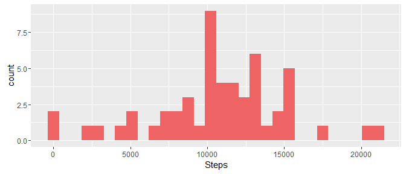

# Reproducible Research - Assignment 1
DT  
04 August 2016  
***************************************************

### Summary:

This assignment answers a series of questions related to personal movement using small devices with built-in movement sensors. These devices generate large amounts of raw data that after processing and applying suitable statistical tools, enable us to track our physical activities. From the data recorded on these devices, we can then make adjustments to our physical activity regimens with possible improvements  in our own health, by knowing how regular we are doing our activities, and in some cases even to detect if we are doing our activities in the correct way.


### Scope:
As part of the Coursera assessment, the work described here is restricted to the following tasks: 

*   *Loading and preprocessing the data.*
*   *What is mean total number of steps taken per day?*
*   *What is the average daily activity pattern?*
*   *Inputing missing values*
*   *Are there differences in activity patterns between weekdays and weekends?*
*   *Write a report describing the above activities (this present document)*

### Data collection:
*This device collects data at 5 minute intervals throughout the day. The data consists of two months of data from an anonymous individual collected during the months of October and November, 2012 and include the number of steps taken in 5 minute intervals each day.The dataset is stored in a comma-separated-value (CSV) file and there are a total of 17,568 observations in this dataset.*

### Report layout description:
The format of this written report is not as rigourous as the format of a scientific report to be submitted for a specialized publication. On the other hand, it follows the guidelines on Reproductible Research:

*   *Defining the question*
*   *Defining the ideal dataset*
*   *Determining what data you can access*
*   *Obtaining the data*
*   *Cleaning the data*
*   *Exploratory data analysis*
*   *Statistical prediction/modeling*
*   *Interpretation of results*
*   *Challenging of results*
*   *Synthesis and write up*
*   *Creating reproducible code*

All the above items were considered in answering the questions detailed in the scope above.

NOTE: Expressions and some sentences in *italic* or ***italic_bold*** are from references cited at the end of this report.

***************************************************

#### A. *Loading and preprocessing the data* 
# 
***A1. Load the data (i.e. read.csv())***

The raw data can be downloaded, unzipped and loaded as follows:


```r
#   Some assumptions: You have installed ggplot2 and dplyr packages. If not, please run: 
#   install.packages('ggplot2'); install.packages('dplyr');
#
fileUrl <- "https://d396qusza40orc.cloudfront.net/repdata%2Fdata%2Factivity.zip"
download.file(fileUrl, destfile="./activity.zip")
unzip("./activity.zip",exdir = ".")
rawdata <- read.csv("./activity.csv")
```

#
***A2. Process/transform the data (if necessary) into a format suitable for your analysis***

Once the data is loaded as `rawdata` we can **explore the data**:


```r
str(rawdata)
```

```
## 'data.frame':	17568 obs. of  3 variables:
##  $ steps   : int  NA NA NA NA NA NA NA NA NA NA ...
##  $ date    : Factor w/ 61 levels "2012-10-01","2012-10-02",..: 1 1 1 1 1 1 1 1 1 1 ...
##  $ interval: int  0 5 10 15 20 25 30 35 40 45 ...
```

The raw data shows a data structure of a total of 17,568 observations and three variables.
The variables are:

* steps: Number of steps taking in a 5-minute interval
* date: The date on which the measurement was recorded
* interval: an identifier for the recorded measurement taken at 5-minute intervals

The variable `date` is classified as `Factor`. We can convert it to a better format, i.e., `Date` class:


```r
rawdata$date <- as.Date(rawdata$date)
```

Now let's take a look into the data


```r
rawdata[10:15,]
```

```
##    steps       date interval
## 10    NA 2012-10-01       45
## 11    NA 2012-10-01       50
## 12    NA 2012-10-01       55
## 13    NA 2012-10-01      100
## 14    NA 2012-10-01      105
## 15    NA 2012-10-01      110
```

```r
rawdata[287:292,] 
```

```
##     steps       date interval
## 287    NA 2012-10-01     2350
## 288    NA 2012-10-01     2355
## 289     0 2012-10-02        0
## 290     0 2012-10-02        5
## 291     0 2012-10-02       10
## 292     0 2012-10-02       15
```

Note that the `interval`values jump from 55 to 100, and 2355 to 0 in the above example. It is like a change from 00:55 to 01:00 and 23:55 to 00:00 in 24 hour format, respectively. Now let's see an exploratory plot:


```r
library(ggplot2)
qplot(data=rawdata,interval,steps,alpha=I(1/3), color=I("indianred3"))
```


The above plot shows how the total steps are distributed into intervals. Observe that the `interval` variable in the plot looks like a "bin" width of 1 hour with 288 sequential measurements with 5-minute periods. So, **each "bin" can be read as the step activity between "00:00" and "01:00", "01:00" and "02:00",...,"22:00" and "23:00", "23:00" and "24:00" per each day**.

We can also summarize the `rawdata` by:


```r
summary(rawdata)
```

```
##      steps             date               interval     
##  Min.   :  0.00   Min.   :2012-10-01   Min.   :   0.0  
##  1st Qu.:  0.00   1st Qu.:2012-10-16   1st Qu.: 588.8  
##  Median :  0.00   Median :2012-10-31   Median :1177.5  
##  Mean   : 37.38   Mean   :2012-10-31   Mean   :1177.5  
##  3rd Qu.: 12.00   3rd Qu.:2012-11-15   3rd Qu.:1766.2  
##  Max.   :806.00   Max.   :2012-11-30   Max.   :2355.0  
##  NA's   :2304
```

#
The sumarized data (see above) also shows the earliest (min) and latest (max) recorded `date` values, that is, 2012-10-01 and 2012-11-30, respectively. We can check how many measurements were recorded during this period:


```r
table(rawdata$date)
```

```
## 
## 2012-10-01 2012-10-02 2012-10-03 2012-10-04 2012-10-05 2012-10-06 2012-10-07 2012-10-08 2012-10-09 
##        288        288        288        288        288        288        288        288        288 
## 2012-10-10 2012-10-11 2012-10-12 2012-10-13 2012-10-14 2012-10-15 2012-10-16 2012-10-17 2012-10-18 
##        288        288        288        288        288        288        288        288        288 
## 2012-10-19 2012-10-20 2012-10-21 2012-10-22 2012-10-23 2012-10-24 2012-10-25 2012-10-26 2012-10-27 
##        288        288        288        288        288        288        288        288        288 
## 2012-10-28 2012-10-29 2012-10-30 2012-10-31 2012-11-01 2012-11-02 2012-11-03 2012-11-04 2012-11-05 
##        288        288        288        288        288        288        288        288        288 
## 2012-11-06 2012-11-07 2012-11-08 2012-11-09 2012-11-10 2012-11-11 2012-11-12 2012-11-13 2012-11-14 
##        288        288        288        288        288        288        288        288        288 
## 2012-11-15 2012-11-16 2012-11-17 2012-11-18 2012-11-19 2012-11-20 2012-11-21 2012-11-22 2012-11-23 
##        288        288        288        288        288        288        288        288        288 
## 2012-11-24 2012-11-25 2012-11-26 2012-11-27 2012-11-28 2012-11-29 2012-11-30 
##        288        288        288        288        288        288        288
```

Therefore, there were a total of 61 days with 288 measurements per day being recorded. 

The summarized data above also shows that there are 2304 `NA`'s. Any missing value in the rawdata appears as "NA". Furthermore, the data structure (`str(rawdata)`) showed `NA` values in `steps`. We can calculate the number of `NA` in this variable by: 


```r
sum(is.na(rawdata$steps))
```

```
## [1] 2304
```

Therefore, all of `NA` in the `rawdata` is located at variable `steps` and represents *ca.* 4.4% of the total rawdata.

Finaly, we can determine which days have `NA` values:


```r
library(dplyr)
noNArawdata <- filter(rawdata, is.na(steps))
unique(noNArawdata$date)
```

```
## [1] "2012-10-01" "2012-10-08" "2012-11-01" "2012-11-04" "2012-11-09" "2012-11-10" "2012-11-14"
## [8] "2012-11-30"
```

Therefore, 8 days out of the total where no measurements were recorded or where the number of steps failed to be recorded. Since there were 288 measurements per day, this means **2304** of `NA`s values which corresponds to the value previously found.

***************************************************

#### B. *What is mean total number of steps taken per day?*

*For this part of the assignment, you can ignore the missing values in the dataset.*

#
***B1. Calculate the total number of steps taken per day***

We can use the function `aggregated()` to obtain the total number of steps per day


```r
totalStepsDay <- aggregate(rawdata$steps, list(date=rawdata$date), sum)
head(totalStepsDay)
```

```
##         date     x
## 1 2012-10-01    NA
## 2 2012-10-02   126
## 3 2012-10-03 11352
## 4 2012-10-04 12116
## 5 2012-10-05 13294
## 6 2012-10-06 15420
```

Therefore the object `totalStepsDay` contains the total number of steps taken per day of measurment. 

#
***B2. Make a histogram of the total number of steps taken each day***

To build the histogram, we need to calculate the total number of steps per day:


```r
totalStepsDay <- aggregate(rawdata$steps, list(date=rawdata$date), sum)
qplot(totalStepsDay$x,geom="histogram",fill = I("indianred2"), na.rm=TRUE) +labs(x="Steps")
```



Note `qplot` ignore the `NA`.

#
***B3. Calculate and report the mean and median total number of steps taken per day***

The mean and median values for the total number of steps taken each day are:

```r
mean(totalStepsDay$x, na.rm = TRUE)
```

```
## [1] 10766.19
```

```r
median(totalStepsDay$x,na.rm = TRUE)
```

```
## [1] 10765
```

***************************************************

#### C. *What is the average daily activity pattern?*
#

***C1. Make a time series plot (i.e. type = "l") of the 5-minute interval (x-axis) and the average number of steps taken, averaged across all days (y-axis).***

We can obtain the average of the total number of steps measured per 5-minute intervals across all days by using `aggregate()`:


```r
MeanTotalStepsDay <- aggregate(rawdata$steps, list(interval=rawdata$interval), mean, na.rm=TRUE)
colnames(MeanTotalStepsDay) <- c("Interval","Average")
qplot(data=MeanTotalStepsDay, x=Interval, y=Average,geom="line",main="Average number of Steps across all days",ylab="Average steps", xlab="Interval Number (5-minutes)", colour=I("steelblue"))
```


#
***C2. Which 5-minute interval, on average across all the days in the dataset, contains the maximum number of steps?***

To determine the interval, we have to obtain the maximum value for the average steps across all days in meanStepDate:


```r
maxim <- filter(MeanTotalStepsDay, Average==max(MeanTotalStepsDay$Average))
maxim
```

```
##   Interval  Average
## 1      835 206.1698
```

So, the maximum average activity acrross all days happens around 835 or 8:35min.  
 
***************************************************

#### D. *Inputing missing values*
*Note that there are a number of days/intervals where there are missing values (coded as `NA`). The presence of missing days may introduce bias into some calculations or summaries of the data.*
#

***D1. Calculate and report the total number of missing values in the dataset (i.e. the total number of rows with `NA`s)***

This was already established before in the data exploratory. The total number of rows with `NA`s is **2304**, all located at the `steps` variable (column) of `rawdata`.

#
***D2. Devise a strategy for filling in all of the missing values in the dataset. The strategy does not need to be sophisticated. For example, you could use the mean/median for that day, or the mean for that 5-minute interval, etc.***

We will replace `NA`s by the average number of steps across all days, that is, using the profile figure shown in Section C1 on the days where `NA`s appear.

#
***D3. Create a new dataset that is equal to the original dataset but with the missing data filled in.***

We can split the `rawdata` into a list of data subset per Date with `split()` function. Then, we can replace those days where `NA` appears in all the intervals by the average number of steps across all days (`MeanTotalStepsDay$Average`), and finally recreating the original data frame but now with the replaced `NA`s values. See below:


```r
srawdata <- split(rawdata, rawdata$date)
for (i in 1:length(srawdata)) {
    if (unique(srawdata[[i]]$date) %in% unique(noNArawdata$date)) {
            srawdata[[i]]$steps<-MeanTotalStepsDay$Average}}
newRawdata <- unsplit(srawdata, rawdata$date)
str(newRawdata)
```

```
## 'data.frame':	17568 obs. of  3 variables:
##  $ steps   : num  1.717 0.3396 0.1321 0.1509 0.0755 ...
##  $ date    : Date, format: "2012-10-01" "2012-10-01" "2012-10-01" ...
##  $ interval: int  0 5 10 15 20 25 30 35 40 45 ...
```

#
***D4. Make a histogram of the total number of steps taken each day and Calculate and report the mean and median total number of steps taken per day. Do these values differ from the estimates from the first part of the assignment? What is the impact of inputing missing data on the estimates of the total daily number of steps?***

The histogram can be obtained by:


```r
tempdata <- aggregate(newRawdata$steps, list(date=newRawdata$date), sum)
qplot(tempdata$x,geom="histogram",fill = I("steelblue"), na.rm=TRUE) +labs(x="Steps")
```


The mean and median values of total number of steps taken per day with the `NA` replacement values (calculated in D3 above) are:


```r
mean(tempdata$x)
```

```
## [1] 10766.19
```

```r
median(tempdata$x)
```

```
## [1] 10766.19
```

The mean value is the same as that for `rawdata` while the median value is slightly different.
The impact of replacing the missing data is small by the replacement of `NA` values per the average value of 5-minute intervals. This was already expected from the exploratory data where we estimated that the percentage of `NA` was small (around 4.4%).

The median value was the parameter that slightly differed after `NA` replacement. The most likely reason being the inclusion of additional steps, also observed in the increase of the overall area of the histogram for the total number of steps. Therefore, it is to be expected that the median increases towards the region near to the mean.

***************************************************

#### E. *Are there differences in activity patterns between weekdays and weekends?*
*For this part the `weekdays()` function may be of some help here. Use the dataset with the filled-in missing values for this part.*

#
***E1. Create a new factor variable in the dataset with two levels -- "weekday" and "weekend" indicating whether a given date is a weekday or weekend day.***

First we define `weekend` days as "Saturday","Sunday", then using `mutate()` from `dplyr` package we create a new variable (initially logical) `dayType` with the day of respective `date` defined as being weekend or not. Then we redefine the `dayType` as "weekday" or "weekend". See below:


```r
weekend <- c("Saturday","Sunday")
newdata <- mutate(newRawdata, dayType = weekdays(date)%in%weekend)
newdata$dayType <- factor(newdata$dayType, labels = c("weekday", "weekend"))
```

#
***E2. Make a panel plot containing a time series plot (i.e. `type = "l"`) of the 5-minute interval (x-axis) and the average number of steps taken, averaged across all weekday days or weekend days (y-axis)***

with the `newdata`:


```r
ggplot(newdata, aes(interval,steps))+facet_wrap(~dayType, ncol=1)+ stat_summary(fun.y = mean, geom="line", colour = "steelblue")+labs(y="Average steps", x="Interval")+geom_hline(yintercept = 120, colour="red")+geom_vline(xintercept = 530, colour="green")+geom_vline(xintercept = 900, colour="green")
```


We observe that the average steps on weekdays is higher than on weekends between the 530 and 900 intervals (or 5:30 to 9:00). After 900 (9:00), the weekdays activity is, on average, lower than on weekends. The activity pattern in the last period is expected if we assume that on weekdays the individual is working and that the work has low physical activity when compared to activity on weekend days. At weekend, it is expected that the physical activity is low for early hours, or before 9:00.

The average steps on days of the week across all the measured days, can be also obtained by:


```r
newdata1 <- mutate(newRawdata, dayType = weekdays(date))
tempdata1 <- aggregate(newdata1$steps,list(dayType=newdata1$dayType), mean)
qplot(data=tempdata1, x=dayType,weight=x,geom="bar", fill = dayType)+geom_hline(yintercept = mean(tempdata1$x), colour="red")
```


x$name <- factor(x$name, levels = x$name[order(x$val)])

The horizontal red line is the total average value across all days. Except for "Wednesdays" and "Fridays", the weekdays' activity is on average smaller than weekend days. The weekend days ("Saturdays" and "Sundays") show the highest values, meaning that there is more activity at the weekend. This agrees with the previous results.

***************************************************
## References:

*   [GitHub repository created for this assignment](http://github.com/rdpeng/RepData_PeerAssessment1)

*   [Report Writing for Data Science in R](https://leanpub.com/reportwriting?utm_source=coursera&utm_medium=syllabus&utm_campaign=CourseraSyllabus)
